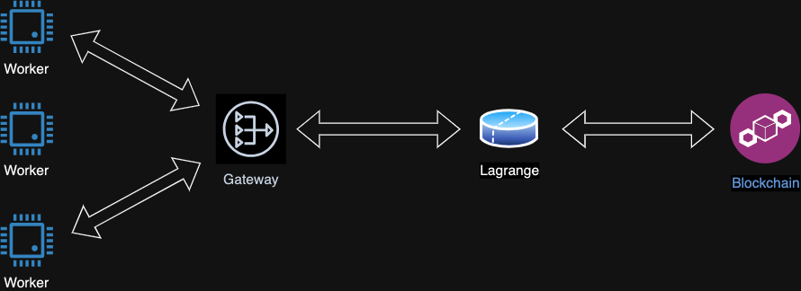

# Deploy a Worker

An AVS operator is expected to serve proving requests from Lagrange network by running a `Worker` binary. The Lagrange sequence sends through the `Gateway` tasks to workers containing all the necessary inputs to generate zkproofs. The worker continuously listens for such tasks and generate proofs accordingly.



This is a step by step guide to deploy your own worker.

---
If you prefer video content you can watch this [video tutorial](https://www.youtube.com/watch?v=zRY7AwrJo4w)

---

### Pre-Requirements

There are **3** different types of workers. Every type can generate a specific type of proof.
You can choose your infrastrcture depending on the type of proof you would like to be able to generate.

| Worker Type | Cores (Dedicated) | vCPU (Cloud) | Memory | Disk | Internet | Proposed Hetzner instance|
| --- | --- | --- | --- | --- | --- | --- |
| `small` | 8 | 20 | 40 GB | 60GB | ✅ | [AX-52](https://www.hetzner.com/dedicated-rootserver/ax52/)|
| `medium` | 8 | 40 | 80 GB | 60GB | ✅ | [AX-52](https://www.hetzner.com/dedicated-rootserver/ax52/)|
| `large` | 16 | 90 | 180 GB | 60GB | ✅ | [AX-102](https://www.hetzner.com/dedicated-rootserver/ax102/)|

### Setup Steps

1. Install `Docker` by following this [guide](https://docs.docker.com/engine/install/)
2. Clone this repo

```sh
git clone https://github.com/Lagrange-Labs/lgn-coprocessor.git
cd lgn-coprocessor
```

3. Generate a Lagrange key

```sh
#Generate the key
docker compose run --rm worker avs new-key
```

You should see something like this

```sh
Input password for Lagrange key:
new Lagrange keystore stored under config/lagr_keystore.json
 public_key = "66779122cb188d1e70889278ffb3ee8ee024d4a23742a59afbdaaa096fc5135c3a14d897de87d1c56adbe029619c231416e7dfb3f1de0a542dd8ac7f4748ce07"
```

4. Add the Ethereum keystore under `config/priv_key.json`. * This is the operator keystore generated by [EigenLayer cli](https://docs.eigenlayer.xyz/eigenlayer/operator-guides/operator-installation#cli-installation)
5. Register the Lagrange key on-chain by signing it with the AVS operator key

```sh
docker compose run --rm worker avs register
```

6. You are now registered, you can go ahead and remove the keystore from  `config/priv_key.json`
7. Add the Lagrange password to the `.env` file so that the service can be restarted without any manual intervention.

```sh
# set the AVS__LAGR_PWD key with the password you have set
vim .env
```

### Run the worker Steps

1. Run the worker

```sh
docker compose up -d
```

### Run the worker from source

1. Clone this repo

```sh
git clone https://github.com/Lagrange-Labs/lgn-coprocessor.git
cd  lgn-coprocessor
```

2. Check your Rust toolchain

```sh
rustup toolchain list
nightly-2024-12-03... (It is recommended)
```

2. Update the worker configuration

```sh
cat lgn-worker/src/config/default.toml
```

3. Update the system maximum stack size to unlimited

```sh
ulimit -s unlimited
```

4. Build and run the worker

```sh
RUST_BACKTRACE=1 RUST_LOG=debug cargo run --release --bin lgn-worker -- --config YOUR_CONFIG.toml
```

### Observability

#### Metrics

The worker exposes the prometheus metrics by default on port 9000

#### Dashboard

Starting from worker version `v0.2.1`, you can import this [grafana dashboard](https://grafana.com/grafana/dashboards/21302-worker/)
